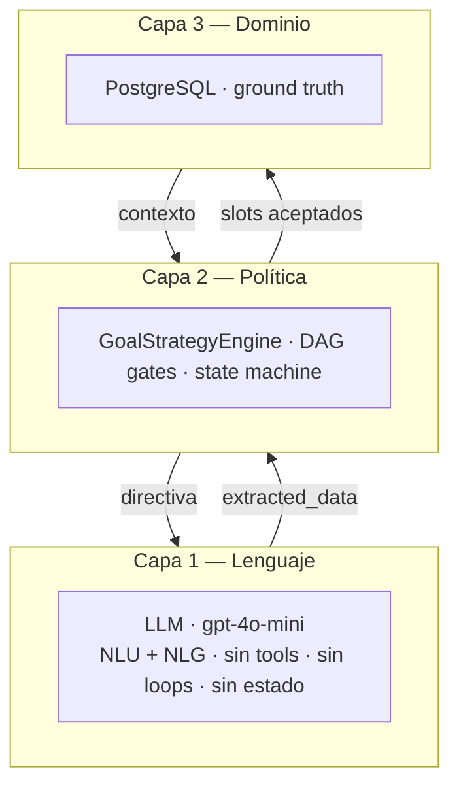
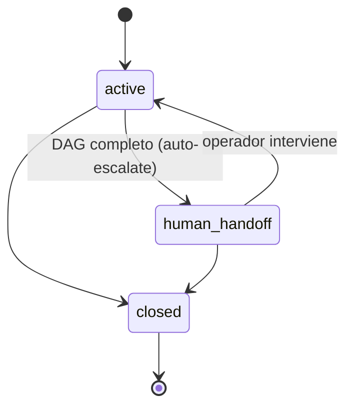
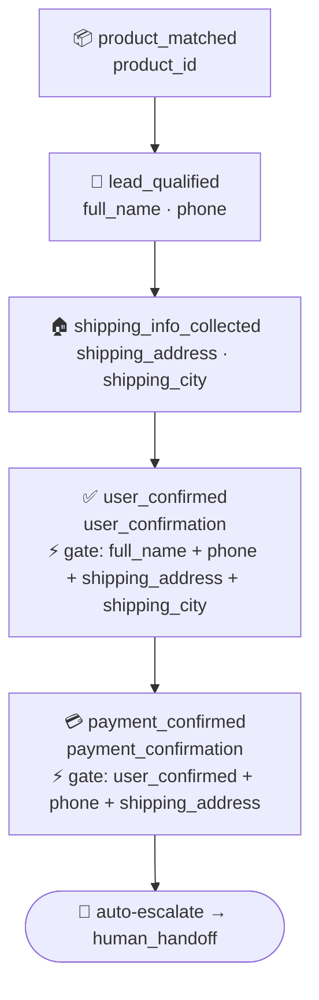
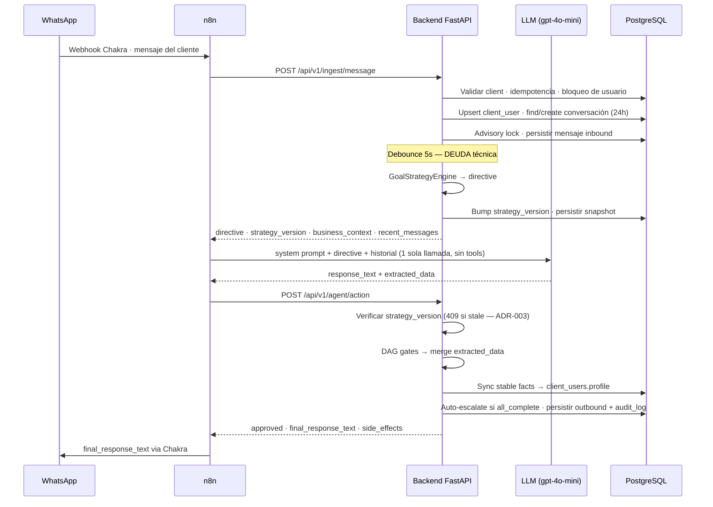

# CLAUDE.md — Sales AI Agent Backend


> Para entender el *por qué* de las decisiones, leer `docs/decisions/`. Para entender la arquitectura conceptual, leer `docs/architecture/overview.md`.

---

## Qué es esto

Backend de ventas por WhatsApp multi-tenant. **El LLM conversa, el backend gobierna.** El LLM (gpt-4o-mini vía OpenAI) genera lenguaje natural y propone slots de datos. El backend valida cada propuesta contra reglas deterministas antes de persistir.

Stack: FastAPI (async) + PostgreSQL 16 + asyncpg/SQLAlchemy 2.0. Azure Container Apps. n8n orquesta WhatsApp ↔ Backend ↔ LLM. Chakra HQ maneja la API de WhatsApp.

---

## Arquitectura en 3 capas



Cada turno = 2 HTTP calls de n8n al backend, 1 LLM call al medio. Sin tool-calling, sin agent loops.

---

## Schema de DB actual (post-migration 007)

7 tablas activas. NO existen `leads`, `orders`, `order_line_items` (dropeadas en 007 — ver ADR-004).

```
clients              tenant boundary
client_users         end customers + profile JSONB persistente
products             catálogo por client
conversations        sesión de chat + extracted_context JSONB + strategy_*
messages             trail de mensajes con metadatos AI
audit_log            eventos append-only
```

**Reglas de schema**:
- Toda tabla tenant-facing tiene `client_id UUID NOT NULL FK` no nulable
- ENUMs como `VARCHAR + CHECK CONSTRAINT` (no native ENUMs — ver ADR-006)
- Toda query debe filtrar por `client_id` (multi-tenant por aplicación, no RLS — deuda)
- Triggers de `updated_at` en clients/client_users/products/conversations
- Idempotencia de mensajes vía `messages.chakra_message_id UNIQUE`

---

## Estado conversacional

3 estados actuales (post-refactor 2026-04-19 — ver ADR-007):



Toda conversación nueva nace en `active`. Auto-escala a `human_handoff` cuando todos los checkpoints del DAG están completos. `closed` es terminal.

---

## DAG de close_sale (vigente)



NO existen `intent_identified` ni `order_created` (removidos — ver ADR-008 cuando se escriba).

**DAG gates en `agent_action.py`**:
- `user_confirmation` requiere full_name + phone + shipping_address + shipping_city presentes
- `payment_confirmation` requiere user_confirmation + phone + shipping_address presentes
- Si el gate rechaza un slot, la respuesta del LLM al usuario igual se envía (fail-safe)

---

## El patrón de dos llamadas



---

## Reglas de modificación

**Cuando crear una migración** (`migrations/versions/NNN_*.sql`):
- Cambio de schema de cualquier tabla
- Cambio de seed data del cliente demo (Café Arenillo)
- Cambio del `system_prompt_template` de un cliente
- Cambio de `business_rules` JSONB que afecta comportamiento del bot

Numeración secuencial. NO modificar migraciones ya aplicadas — siempre crear una nueva.

**Cuando crear un ADR** (`docs/decisions/ADR-NNN-*.md`):
- Decisión arquitectónica que alguien preguntará en 6 meses por qué la tomamos
- Adopción/abandono de una librería
- Cambio en patrón de seguridad/auth
- Drop de tabla, columna o feature significativa

**Cuando NO modificar este archivo**:
- Si la decisión va a un ADR y el estado actual no cambia, basta con el ADR
- Para historia, justificaciones largas, alternativas consideradas → ADR

**Cuando SÍ modificar este archivo**:
- Cambio en arquitectura de capas, schema activo, estado de DAG, estados de conversación
- Aparece nueva pieza operacional (job nocturno, integración nueva, etc.)
- Cambio en convenciones de código

---

## Convenciones de código

- **Async everywhere**: SQLAlchemy 2.0 async, asyncpg, FastAPI async endpoints
- **Type hints obligatorios** en signatures de servicios (no en helpers triviales)
- **Pydantic** para todo request/response schema
- **Logging estructurado**, nunca PII en plaintext
- **Constant-time comparisons** para tokens (`hmac.compare_digest`)
- **Tenant filtering** en TODA query (`WHERE client_id = ...`)
- **PII masking** en logs (ver `_mask_phone` en `ingest.py`)

**Estructura de servicios**:
- `services/` = lógica pura, testeable sin red ni DB cuando posible
- `api/v1/` = endpoints FastAPI delgados, delegan a servicios
- `models/` = ORM SQLAlchemy
- `core/` = configuración, DB, auth

**Tests**:
- `tests/services/` = pure-python, rápidos, corren en cada commit
- `tests/integration/` = contra Postgres real, corren antes de mergear (DEUDA: no existen aún)

---

## Deuda técnica visible

| # | Item | Severidad | Bloquea cliente que paga? |
|---|------|-----------|---------------------------|
| 1 | Sin tests de integración (cero contra Postgres) | Alta | Sí |
| 2 | Debounce con `asyncio.sleep(5)` durante transacción ocupa pool | Alta | A medio plazo |
| 3 | Sin telemetría (no hay alertas de fallas silenciosas n8n→backend) | Alta | Sí |
| 4 | Sin vista de operador para human_handoff | Crítica | Sí |
| 5 | Multi-tenant defendido por aplicación, no por RLS | Media | Al 3er cliente |
| 6 | Auth: un solo token compartido sin rotación ni scopes | Media | Al escalar callers |
| 7 | Bug de re-saludo después de N días (extracted_context se pierde entre conversaciones) | Media | Notable pero no bloqueador |
| 8 | LLM puede inventar formatos en extracted_data (sin structured output) | Media | Sí, si no se ataja |
| 9 | Sin pruebas de carga — desconocemos throughput máximo | Alta | Sí (no se puede ofrecer SLA) |
| 10 | Reset de extracted_context por idle 30 min puede borrar contexto legítimo | Baja | No |

**Próximo trabajo prioritario** (ver `docs/decisions/` cuando se decida):
- Fase 0: structured output (Pydantic + response_format), tests de integración, load test
- Fase 1: tabla `purchase_intents` para preservar venta entre conversaciones
- Fase 2: front de operador (3 pantallas: inbox, dashboard, config)

---

## Producción actual

| Componente | Detalle |
|------------|---------|
| Backend URL | `https://<CONTAINER_APP>.azurecontainerapps.io` |
| Postgres | `<POSTGRES_HOST>.postgres.database.azure.com` / DB `sales_ai` |
| Key Vault | `<KEY_VAULT_NAME>` (DBUSERNAME, DBPASSWORD, DBHOST, DBNAME, sales-ai-service-token) |
| Managed Identity | `<MANAGED_IDENTITY_NAME>` |
| n8n | `<N8N_CONTAINER_APP>.azurecontainerapps.io` |
| Cliente demo | Café Arenillo — `00000000-0000-0000-0000-000000000001` |
| CI/CD | Push a `main` → GitHub Actions → tests + Docker build → ACR push → Container App update |

---

## Glosario rápido

- **client** = tenant (un negocio que usa la plataforma, ej. Café Arenillo)
- **client_user** = end customer (quien escribe por WhatsApp al negocio)
- **conversation** = sesión de chat con ventana de 24h
- **extracted_context** = JSONB en `conversations` con datos recolectados por turno
- **profile** = JSONB en `client_users` con datos persistentes entre conversaciones
- **strategy_version** = entero que se incrementa en cada `/ingest`, valida no-staleness en `/agent/action`
- **directive** = bloque de texto que el GoalStrategyEngine genera para guiar al LLM
- **DAG gate** = validación previa al merge de un slot en extracted_context
- **side_effects** = lista de strings descriptivos en la respuesta de `/agent/action`

Para definiciones extendidas, ver `docs/architecture/glossary.md`.
