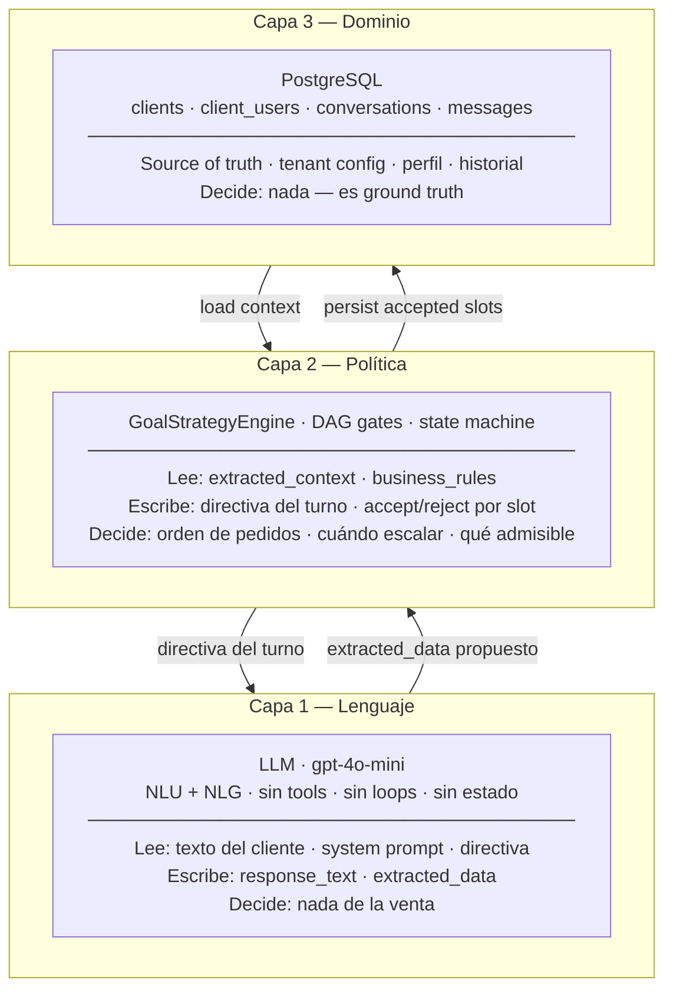
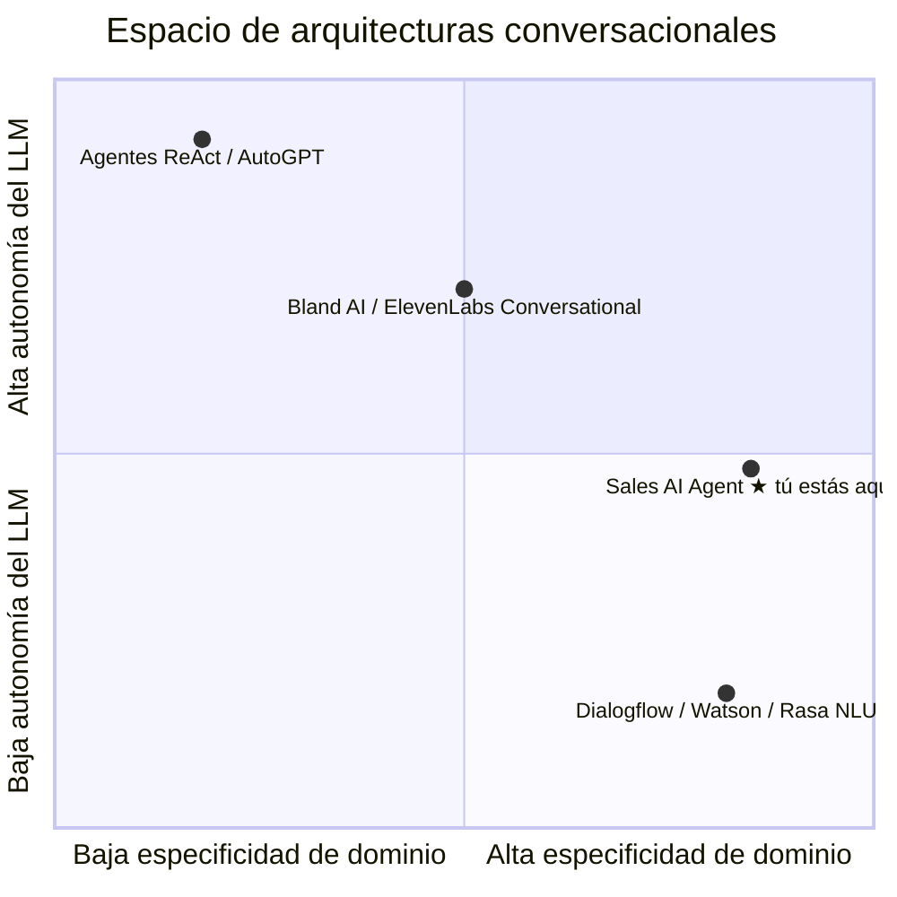
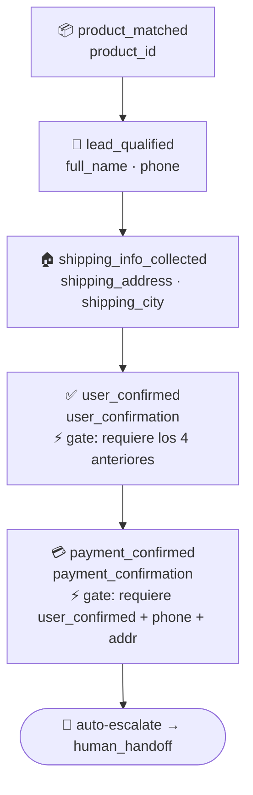
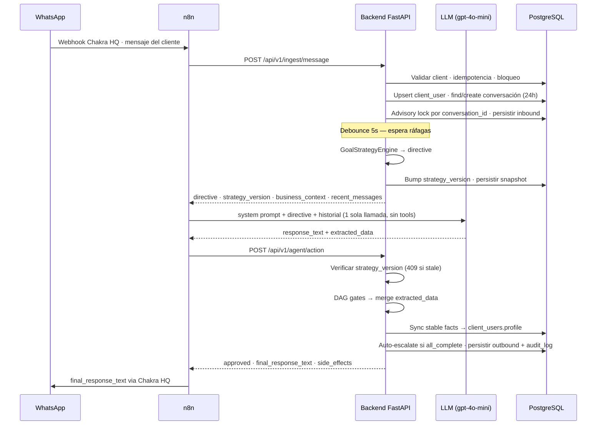

# Arquitectura — Overview

Este documento responde a la pregunta **"¿cómo está pensado este sistema?"**. Para el estado actual operacional, leer `../../CLAUDE.md`. Para el por qué de cada decisión, leer `../decisions/`.

---

## La idea fundamental

> **El LLM conversa, el backend gobierna.**

La mayoría de los chatbots de WhatsApp delegan al LLM no solo la generación de lenguaje sino también las decisiones de negocio: cuándo crear un lead, cuándo proponer un producto, cuándo cerrar una venta. Eso funciona hasta que no funciona — el LLM es probabilístico y las reglas de negocio no lo son.

Sales AI Agent invierte esa relación. El LLM solo entiende y produce lenguaje natural. Todas las decisiones — qué pedir, cuándo escalar, qué dato es admisible — viven en código Python testeable. El LLM **propone**; el backend **valida y ejecuta**.

---

## Las tres capas

**Propiedad clave**: el LLM es la pieza más reemplazable del sistema. Si mañana sale un modelo mejor, se cambia el string del modelo en `clients.ai_model`. Los datos recolectados viven en Postgres, no en el contexto del modelo.

---

## Ubicación en el espacio de arquitecturas

Para ubicar esto frente a otros sistemas conversacionales:

**Lo que tenemos NO es un agente clásico** (estilo ReAct/AutoGPT). En la literatura más cercana, este patrón se conoce como **information-state dialogue manager** (Larsson & Traum, 2000) — un manejador de diálogo cuyo estado es la información acumulada — modernizado con un LLM haciendo NLU/NLG. Comercialmente, el primo más cercano es **Rasa CALM**.

---

## El DAG de close_sale

Cada checkpoint del DAG representa **suficiencia de información**, no una acción del bot. La diferencia es importante: "el bot dijo X" no es lo mismo que "el sistema sabe X". El DAG opera sobre lo segundo.

**Los DAG gates** son la innovación operacional que distingue este sistema de los DAGs académicos (PPDPP, ChatSOP). Cuando el LLM propone un slot prematuramente — por ejemplo, marcar `user_confirmation=true` antes de tener dirección — el gate lo rechaza, registra un warning, pero **la respuesta del LLM al usuario igual se envía**. La conversación nunca se rompe; solo no se persiste el dato prematuro. Esa propiedad de fail-safe es lo que vuelve confiable el sistema.

---

## El patrón de dos llamadas

Cada turno conversacional consta de exactamente 2 HTTP calls de n8n al backend, con 1 llamada al LLM en medio:

**Sin loops, sin tool-calling, sin rama dinámica del LLM.** El backend sabe todo lo que el LLM necesita saber antes de la llamada, y valida todo lo que el LLM produce después de la llamada.

---

## Estado de información en tres niveles

Una conversación tiene tres tipos de información distintos, cada uno con su lugar:

| Tipo | Descripción | Dónde vive | Persistencia |
|------|-------------|------------|--------------|
| **Datos del cliente** | Nombre, dirección, teléfono, preferencias | `client_users.profile` (JSONB) | Multi-conversación (siempre) |
| **Estado de venta** | Producto elegido, cantidad, confirmaciones | `conversations.extracted_context` (JSONB) | Intra-conversación (24h) |
| **Contexto efímero** | Inferencias del último turno | Transitorio en memoria del LLM | Por turno |

> **Limitación conocida**: si un cliente abandona la venta a mitad del flujo y vuelve días después, el estado de venta se pierde porque vive en `extracted_context` de la conversación expirada. El perfil persiste pero el carrito no. Resolverlo requiere una entidad nueva (`purchase_intents`) — pendiente en roadmap.

---

## Multi-tenancy

Cada tabla tenant-facing tiene `client_id UUID NOT NULL FK` que apunta a `clients`. Toda query filtra por `client_id`. La separación entre tenants es por convención en la capa de servicio — **no por Row-Level Security de Postgres**. Un bug en una query que olvide el filtro puede leer datos cross-tenant.

Esto es deuda técnica reconocida que se va a tomar al tercer cliente productivo. Para MVP con un cliente demo, está dentro del riesgo aceptado.

**Customización por cliente** vive en `clients.business_rules` (JSONB):
- `default_goal`: qué goal del DAG se activa por defecto
- `skip_lead_qualification`: omite checkpoint
- `require_id_number`: agrega campo requerido
- `currency`, `shipping_cities`, `shipping_rules`, `payment_methods`, `discount_rules`
- `agent_persona`: nombre del agente, rol

El `system_prompt_template` también es por cliente — cada negocio tiene su propia voz, persona y reglas de tono.

---

## Concurrencia y consistencia

**Problema**: WhatsApp manda ráfagas. Un cliente que escribe "hola" + "quiero comprar" + "café molido" en 3 segundos genera 3 webhooks paralelos. Si los procesamos concurrentemente, el LLM puede ver contextos inconsistentes.

**Soluciones aplicadas**:

1. **Advisory lock** por `conversation_id`: `pg_advisory_xact_lock(hash(conv_id))` serializa los mensajes de la misma conversación dentro de la transacción. Se libera automáticamente con commit/rollback.
2. **Debounce de 5 segundos**: tras commitear el primer mensaje, el backend espera 5s y verifica si llegó otro. Si sí, este turno no responde — deja que el siguiente mensaje (que ahora ve los anteriores) genere la respuesta.
3. **Idempotencia por `chakra_message_id`**: webhook que llega dos veces con el mismo ID se reconoce como duplicado.
4. **strategy_version**: protege contra que `/agent/action` opere sobre contexto que cambió entre las dos llamadas (ver ADR-003).

> **Limitación conocida**: el `asyncio.sleep(5)` durante la transacción mantiene el connection pool ocupado. Bajo carga sostenida puede saturar el pool. Es deuda técnica priorizada.

---

## Filosofía de diseño

Tres principios que se aplican consistentemente:

1. **Fail-safe sobre fail-fast en la conversación.** Si una validación rechaza un slot del LLM, la respuesta al usuario igual se envía. La experiencia del cliente final no se interrumpe nunca por una decisión interna del backend.

2. **Schema-first, then code.** Cada cambio significativo empieza por entender qué datos cambian, en qué tabla, con qué constraints. El código viene después. El `CLAUDE.md` y los ADRs reflejan esta práctica: el diseño se piensa antes de implementarse.

3. **Determinístico donde se puede, probabilístico donde tiene que ser.** Lo que el negocio necesita controlar (orden, validación, persistencia) vive en código testeable. Lo que el cliente final percibe (tono, naturalidad) vive en el prompt y el modelo. La frontera es deliberada.
