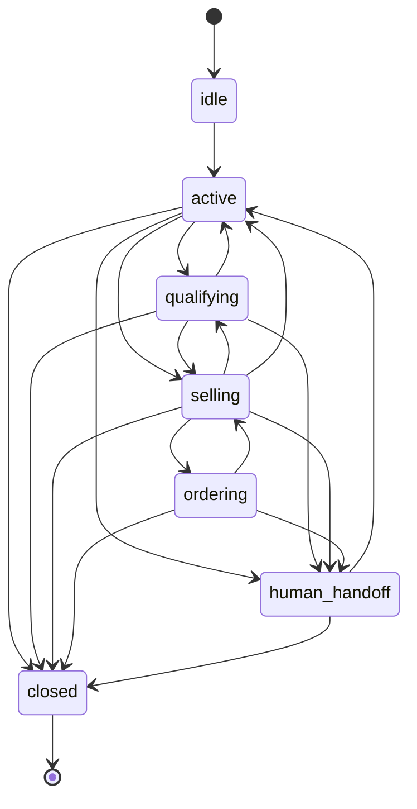
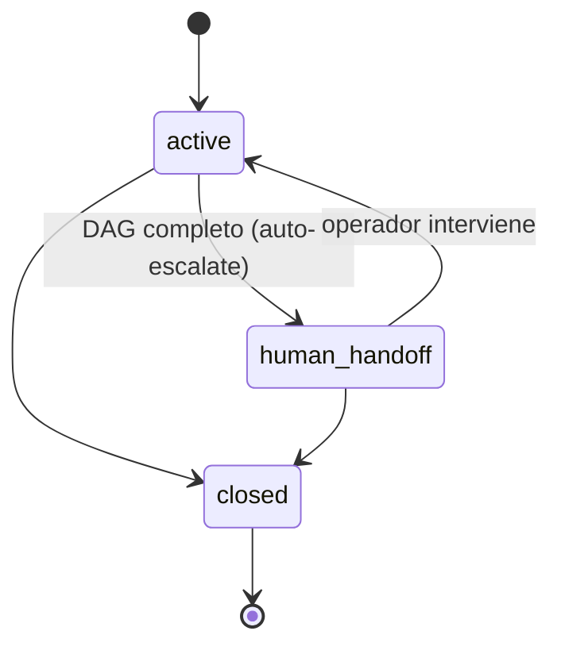

# ADR-007 — Colapso de state machine de 7 a 3 estados

- **Estatus**: Accepted
- **Fecha**: 2026-04-19
- **Decididores**: Sebastian + cofounder/principal architect

## Contexto

El diseño original (migración 001) modelaba la conversación con 7 estados:

Cada estado tenía un set de acciones válidas distintas (`greet`, `classify_intent`, `ask_question`, `search_products`, `propose_order`, `confirm_order`, `escalate`, etc.) que el agente podía proponer y el backend validaba.

La intención era restringir lo que el LLM podía hacer en cada fase: no se permite `propose_order` mientras la conversación esté en `qualifying`, no se permite `confirm_order` mientras esté en `ordering` sin datos completos, etc.

Auditando los datos al 19 de abril:
- Ninguna conversación había transicionado fuera de `active` o `human_handoff`. El sistema usaba en producción sólo 3 de los 7 estados.
- Las transiciones entre estados internos (`qualifying → selling → ordering`) nunca se disparaban porque ya no existían action handlers que las propusieran.
- La validación de "qué acción es válida en qué estado" era código muerto — el agente no proponía acciones (ver ADR-002 sobre eliminación de tools).

Mantener 7 estados con sus tablas de transiciones, validaciones, y código asociado era complejidad sin valor.

## Decisión

Colapsar la state machine a 3 estados:

- **active**: conversación normal, bot responde
- **human_handoff**: escalada a operador humano, bot ya no responde
- **closed**: terminada, terminal

La progresión del flujo de venta (qualifying, selling, ordering) ya no se modela como estado conversacional sino como **progreso del DAG** (`progress_pct`, `current_checkpoint` en `conversations`). Esa es información estratégica, no estado del diálogo.

## Alternativas consideradas

- **Mantener 7 estados pero documentarlos como aspiracionales**: descartado. Estado en DB que nunca se usa es trampa para Claude Code y para humanos nuevos.
- **Colapsar a 4 estados (agregar `paused`)**: descartado por YAGNI. Si en el futuro necesitamos `paused`, se agrega.
- **Eliminar la state machine completa**: descartado. Necesitamos al menos `active vs human_handoff vs closed` para que n8n y el front sepan si el bot debe responder.

## Consecuencias

### Positivas
- State machine refleja el comportamiento real. Razonar sobre el sistema es más simple.
- Menos código que mantener (las funciones `validate_action`, los action handlers, las transiciones entre estados internos) — todo eliminado en el refactor.
- La distinción "fase del diálogo" vs "progreso de venta" queda explícita: lo primero es el estado, lo segundo es el DAG. Cada uno responde a una pregunta distinta.

### Negativas
- Si un cliente futuro necesita comportamientos diferenciados por fase (ej. tono distinto en qualifying vs selling), no podemos hacerlo a nivel de state machine — habría que modelarlo dentro del prompt o como overrides de `business_rules`.
- Perdimos la capacidad de "auto-pausar" una conversación en estados intermedios. Si quisiéramos pausar mientras esperamos confirmación humana de un dato puntual sin escalar completo, no hay estado para eso.

### Trade-offs explícitos
- Aceptamos menos expresividad del state machine a cambio de coherencia con la realidad. Si la expresividad vuelve a hacer falta, se reintroduce con justificación específica.

## Cuándo revisar

Revisar esta decisión si:
- Aparece un caso de uso real donde necesitamos diferenciar "el bot está esperando algo específico" de simplemente "active"
- Un cliente requiere flujos donde el bot responde diferente según una fase intermedia que hoy no modelamos
- El front de operador necesita mostrar "en qué fase está cada conversación" — podríamos derivarlo del DAG progress, pero si necesitamos un eje distinto, este ADR se revisa
